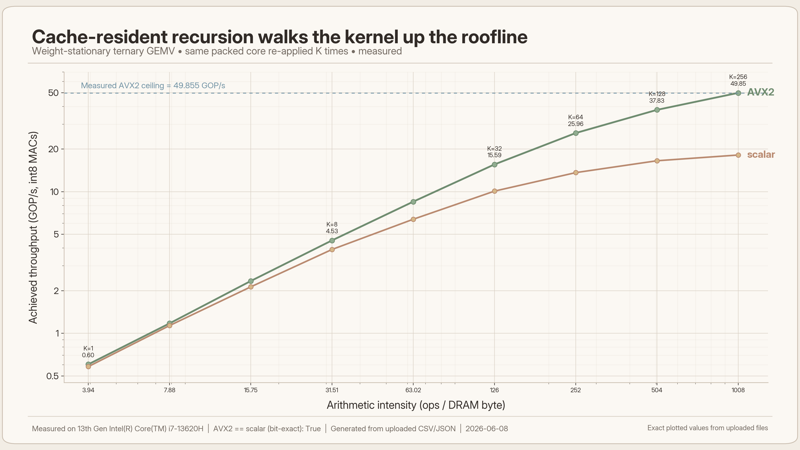
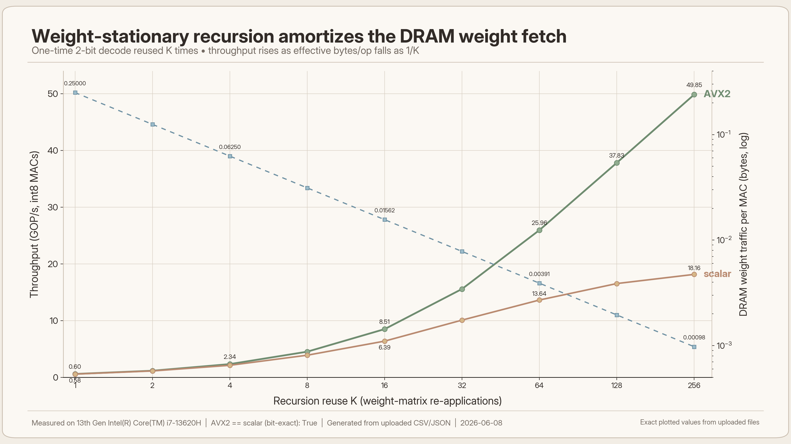
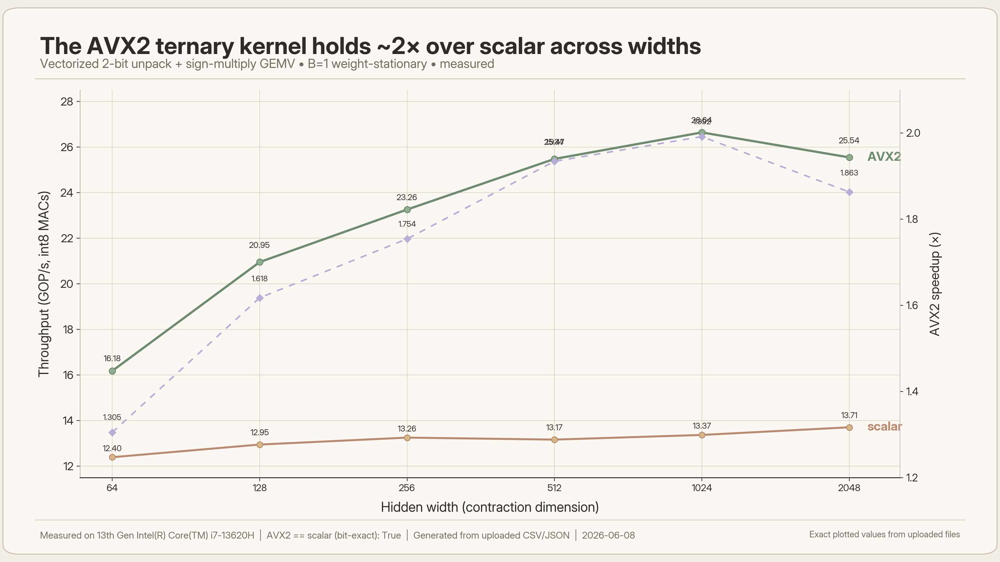
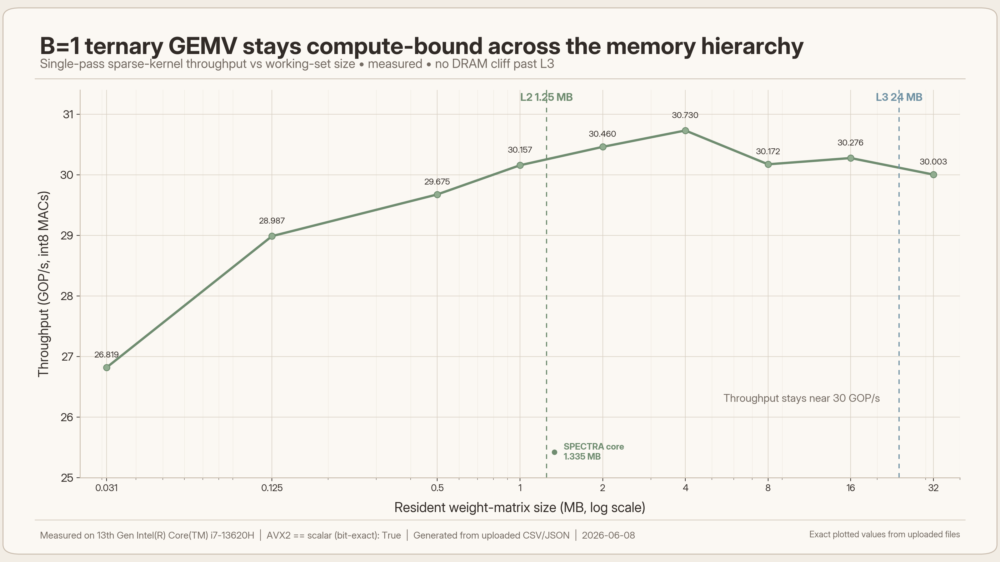
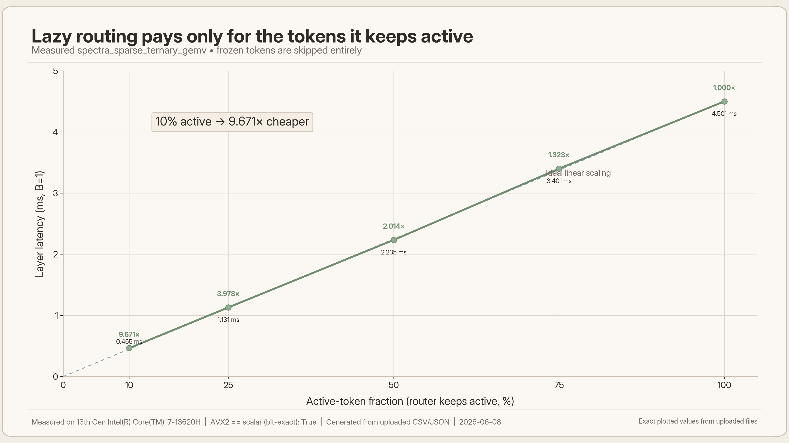
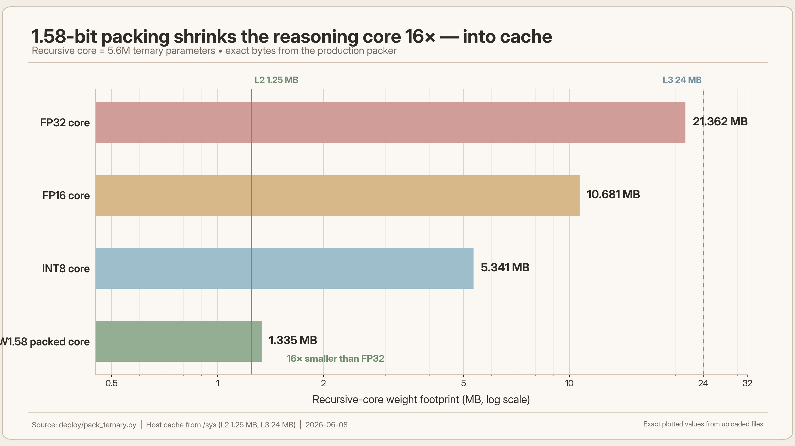

<div align="center">

# SPECTRA

### Sparse Policy-guided Energy-aware Cache-Ternary Recursive Agent

**An edge-native o1** — a 1.58-bit recursive reasoner that recreates the test-time-compute paradigm (Cache-Resident Latent MCTS guided by a self-taught, label-free Process Reward Model) on a single legacy CPU core.

[Architecture spec](docs/ARCHITECTURE.md) · [The physics](#1-the-physics-of-b1-ternary-gemv) · [Reasoning stack](#7-the-reasoning-stack) · [Telemetry firehose](#8-the-telemetry-firehose)

</div>

---

## Abstract

SPECTRA is a **high-fidelity scientific instrument** built to test one hypothesis on real silicon: that *learned, cache-resident test-time search* is a second axis of scaling that can substitute for parameter count under a fixed physical joule budget. The reasoning core is **W1.58A8** — ternary weights in `{-1, 0, +1}` with INT8 activations — applied recursively, with AlphaZero-style search running **inside the INT8 latent space** and a Process Reward Model that labels its own intermediate steps from Monte-Carlo backups. Every figure below is **measured on physical hardware**; nothing is illustrative. If a quantity has not been measured, it is not plotted.

**Results at a glance** — host: 13th-Gen Intel Core i7-13620H (L2 `1.25 MB` / L3 `24 MB`, read from `/sys`). Regenerate on any target with `scripts/bench_*.py` → `scripts/render_*.py`.

| Quantity | Measured | Source |
|---|---|---|
| Kernel correctness | **AVX2 ≡ scalar, bit-exact** | `tests/test_kernel.py` |
| B=1 throughput vs reuse `K` | `0.6 → 49.9 GOP/s` (`K = 1 → 256`) | `bench_kernel.py` |
| Arithmetic intensity | `AI = 4K` : `3.9 → 1008 ops/byte` | `eval/roofline.py` |
| AVX2 vs scalar | `1.3–2.0×` (peak `2.7×` at `K = 256`) | SIMD sweep |
| Lazy-routing saving | `10%` active → `9.7×` cheaper (linear) | sparse kernel |
| Memory hierarchy | flat `~30 GOP/s`, `32 KB → 32 MB` | cache sweep |
| Core footprint | `1.34 MB` packed, `16×` vs FP32 | `deploy/pack_ternary.py` |

---

## 1. The physics of B=1 ternary GEMV

At batch size 1 the forward pass is a matrix–vector product: each weight is read **once** and used in **one** multiply-accumulate, so there is no reuse to cache-block and arithmetic intensity (`AI`, ops per DRAM byte) is fixed by precision alone:

$$
\mathrm{AI} \;=\; \frac{\text{ops}}{\text{DRAM bytes}} \;=\; \frac{O\,H}{O\,H \cdot \text{bits}/8} \;=\; \frac{8}{\text{bits}}
\qquad\Longrightarrow\qquad
\mathrm{AI}_{\text{FP32}} = 0.25, \quad \mathrm{AI}_{\text{W1.58}} = 4 .
$$

FP32 is hopelessly memory-bound; W1.58 (2-bit) cuts the streamed bytes `16×` but is still below the ridge point `AI* = P_peak / BW` on most cores. Quantization alone cannot cross the roofline. The move to *compute-bound* comes from recursion: the same ternary core is re-applied `K = T·n·N_sup` times, and if it stays cache-resident, DRAM pays once.

$$
\mathrm{AI}_K \;=\; \frac{K\,O\,H}{O\,H \cdot \text{bits}/8} \;=\; \frac{8K}{\text{bits}} \;=\; 4K,
\qquad
P \;=\; \min\!\big(P_{\text{peak}},\; \mathrm{BW}\cdot\mathrm{AI}\big).
$$

<div align="center">

</div>

Driving the production kernel with reuse `K ∈ [1, 256]` traces the predicted curve exactly: a single GEMV (`K = 1`, `AI ≈ 4`) is memory-bound at `0.6 GOP/s`, and as reuse climbs the operating point walks up the roofline to a compute-bound `~50 GOP/s` at `K = 256` (`AI ≈ 1008`). The `AI` axis is computed by `eval/roofline.py`; the throughput axis is timed.

---

## 2. Weight-stationary recursion

The kernel `spectra_weight_stationary_gemv` decodes each 2-bit weight row **once** and dots it against all `K` recursion-step activations before eviction. The one-time DRAM weight fetch is amortized over `K` applications, so DRAM traffic *per MAC* collapses as `1/K`:

$$
\frac{\text{DRAM weight bytes}}{\text{MAC}} \;=\; \frac{O\,H \cdot \text{bits}/8}{K\,O\,H} \;=\; \frac{\text{bits}}{8K} \;=\; \frac{0.25}{K} \quad(\text{2-bit}).
$$

<div align="center">

</div>

Measured throughput (left axis) rises monotonically with `K` while the exact bytes/MAC (right axis, log) falls as `0.25/K` — the two are the same physical statement. Reuse, not quantization, is what converts a memory-bound GEMV into a compute-bound one.

---

## 3. The fused AVX2 kernel

The hot loop is integer-only and branch-free. Ternary codes are unpacked 32-at-a-time with a single `pshufb` lookup; the dot product uses `_mm256_sign_epi8` (sign-select `±x` or `0`, **no multiplies**); requantization is an integer multiply-shift (no FP division in the loop):

$$
\mathrm{acc}_o \;=\; \sum_{d=1}^{H} w^{q}_{o,d}\, x_d,
\qquad
y_o \;=\; \mathrm{clip}\!\left(\frac{\mathrm{acc}_o\, m_o + 2^{\,s-1}}{2^{\,s}},\; -128,\; 127\right),
\qquad
m_o \approx \frac{\gamma_o\, s_{\text{act}}}{s_{\text{out}}} .
$$

The AVX2 path is validated **bit-for-bit** against a scalar oracle and the PyTorch fake-quant reference.

<div align="center">

</div>

Across contraction widths `H ∈ [64, 2048]` the vectorized kernel sustains `1.3–2.0×` over scalar (up to `2.7×` at high reuse). The gap widens with width as the decode and MACs amortize loop overhead — and the AVX2 output is identical to scalar, so the speedup carries no accuracy cost.

---

## 4. Compute-bound across the memory hierarchy

A textbook B=1 GEMV is memory-bound. SPECTRA's is not. Sweeping the resident weight-matrix size across this CPU's real L2/L3 boundaries (the kernel re-reads the matrix `Nₐ` times) holds throughput flat from L2 into DRAM:

$$
P(|W|) \;\approx\; \text{const} \qquad \text{for}\quad 32\,\text{KB} \;\le\; |W| \;\le\; 32\,\text{MB}\;\; (> \text{L3}).
$$

<div align="center">

</div>

Throughput is identical whether the weights live in L2, in L3, or in main memory past the `24 MB` L3 — there is **no DRAM cliff**. The ternary decode plus `_mm256_sign_epi8` is the bottleneck, not bandwidth, so the effective DRAM rate (`~3.6 GB/s`) sits far below the machine's peak. This is the empirical counterpart of §1: the kernel is decode-limited, which is exactly the regime in which the `1.34 MB` cache-resident core wins.

---

## 5. Lazy active-token routing

A learned RL policy freezes confident tokens; the sparse kernel computes only the active set `Aₖ`, so cost scales with the number of active tokens rather than sequence length `L`:

$$
\text{cost} \;\propto\; |A_k|,
\qquad
\text{speedup} \;=\; \frac{L}{|A_k|}.
$$

The router is trained by the dense GAE-λ objective of §7 with a per-step active-token penalty.

<div align="center">

</div>

Measured `spectra_sparse_ternary_gemv` latency is dead-linear in the active fraction: at `10%` active density the layer is `9.7×` cheaper than dense. Because cost is exactly proportional to the kept tokens, every frozen token is compute the model never spends.

---

## 6. W1.58A8 numerics and footprint

Weights are ternarized per output channel by absmean scaling with a straight-through estimator (forward ternary, gradient to the full-precision master weight), under a soft warmup that ramps `ρ : 0 → 1`. Activations use per-token symmetric INT8.

$$
\gamma_o = \frac{1}{H}\sum_{d=1}^{H} |W_{o,d}|,
\qquad
w^{q}_{o,d} = \mathrm{clip}\!\big(\mathrm{round}(W_{o,d}/\gamma_o),\,-1,\,1\big),
\qquad
W_{\text{fwd}} = (1-\rho)\,W + \rho\,(\gamma \odot w^{q}),
$$

$$
s = \frac{\max_d |x_d|}{127},
\qquad
x^{q} = \mathrm{clip}\!\big(\mathrm{round}(x/s),\,-128,\,127\big).
$$

Ternary codes pack 4-per-byte (`00 → 0`, `01 → +1`, `10 → −1`), so the core costs `⌈N/4⌉` bytes.

<div align="center">

</div>

The `5.6M`-parameter recursive core packs to **`1.34 MB`** — exactly `16×` (= 32/2) smaller than FP32, computed by the production packer, not estimated. That is the precondition for §2 and §4: only at this size does the core stay resident in fast cache so the one-time fetch can be amortized.

---

## 7. The reasoning stack

**Dense, verifier-bootstrapped RL (router/halter).** Per-step credit via GAE-λ instead of a single terminal reward, shaped by the frozen neural energy verifier value `V^ψ = −E_ψ(x, z)`, with a Polyak-tracked target critic and a stop-gradient on the latent to keep the bootstrap stationary (`train/rl.py`):

$$
r_k = \big(V^{\psi}_{k+1} - V^{\psi}_k\big) - \lambda_{\text{tok}}\frac{|A_k|}{L} - \lambda_{\text{step}},
\qquad
\delta_k = r_k + \gamma\, V_\phi(z^{k+1}) - V_\phi(z^k),
\qquad
A_k = \sum_{l \ge 0} (\gamma\lambda)^l\, \delta_{k+l}.
$$

**Cache-Resident Latent MCTS.** Search runs over INT8 latents (never decoding to tokens), expanding nodes with a learned action codebook. Selection uses PUCT on a **pessimistic** value, where `μ, σ` are the mean and disagreement of a deep ensemble, so out-of-distribution latents are penalized rather than chased (`eval/latent_mcts.py`, `model/energy.py`):

$$
a^\star = \arg\max_{a}\Big[\, Q_{\text{LCB}}(s,a) + c_{\text{puct}}\, P(s,a)\, \frac{\sqrt{N(s)}}{1 + N(s,a)} \,\Big],
\qquad
V_{\text{LCB}}(z) = \mu(z) - \beta\,\sigma(z).
$$

**Unsupervised Latent PRM (o1-style, no human labels).** The Monte-Carlo backup already assigns every visited latent a value `qₖ = Wₖ/Nₖ`; regressing the energy verifier onto those backups turns an outcome RM into a *process* RM, visit-weighted toward the parts of the tree the search trusted (`train/distill.py`). Vector quantization bounds compounding recursion error by the codebook covering radius `r`, converting `O(ε·Lᵈ)` drift into a depth-independent `O(r)` (`model/latent_vq.py`):

$$
\mathcal{L}_{\text{PRM}} = \sum_k w_k\big(V_\psi(x, z_k) - q_k\big)^2,\quad w_k \propto N_k,
\qquad
\big\lVert z - \mathrm{snap}(z) \big\rVert \le r .
$$

The effective reasoning depth of the core is `D_eff = T·(n+1)·L_layers` (`model/trm.py`).

---

## 8. The telemetry firehose

`common/telemetry_logger.py` — **`SpectraTelemetryLogger`** extracts five ground-truth streams from a live run, fully decoupled from any plotting:

| Stream | Output | Captured |
|---|---|---|
| MCTS tree | `mcts_graphs.jsonl` | full graph: visits `N`, `Q = W/N`, epistemic `σ`, PRM reward, principal variation |
| Hardware | `hardware_telemetry.csv` | RAPL joules, peak RAM, latency — background sampler |
| Latents | `latent_states.parquet` | raw INT8 `z` plus active-token mask, per step and token |
| Microsecond trace | `trace.json` | Chrome / Perfetto — Python loop vs C++ AVX2 lanes |
| Scaling | `spectra_scaling_laws.csv` | task × params × rollouts × measured joules × correctness |

```python
from common.telemetry_logger import SpectraTelemetryLogger

with SpectraTelemetryLogger("runs/spectra") as log:
    with log.profile_hardware(task_id):            # RAPL + peak RAM + latency
        _, steps = model(x, height=h, width=w)
        best = mcts.search(x)                       # populates mcts.root
    log.export_latents(steps, task_id)             # INT8 latents -> Parquet
    log.dump_mcts_tree(mcts, x, task_id)           # search graph -> JSONL
    log.log_scaling_row(task_id, model=model, mcts_rollouts=mcts.n_rollouts,
                        is_correct=ok, total_joules=j, total_latency_ms=ms)
```

---

## Build and test

```bash
pip install -r requirements.txt
pytest -m "not slow"                      # full fast gate (33 test modules), ~5 min
python setup.py build_ext --inplace       # optional native AVX2 kernel (gcc/Linux or MSVC, AVX2)
pytest tests/test_kernel.py               # AVX2 == scalar == PyTorch, bit-exact
```

The full design specification lives in [`docs/ARCHITECTURE.md`](docs/ARCHITECTURE.md).

## The open question

The kernel, the telemetry firehose, the RAPL/cgroup energy path, and the iso-FLOP dense null-baseline are all in place. The one number this repository will **not** fabricate is the result it was built to find:

> For a fixed physical joule budget on legacy x86, does a small W1.58A8 model plus learned latent search match or beat a larger zero-shot dense model?

The accuracy/energy frontier requires training both families at scale under RAPL — a run that has not yet happened. **This repository is the instrument; the result is the experiment.**

## Citation

```bibtex
@misc{spectra2026,
  title  = {SPECTRA: Cache-Resident Latent Search as a Second Axis of Scaling under a Physical Joule Budget},
  note   = {Open scientific instrument; iso-joule scaling result pending compute},
  year   = {2026}
}
```

## License

Released under the [MIT License](LICENSE). © 2026 The SPECTRA Authors.
