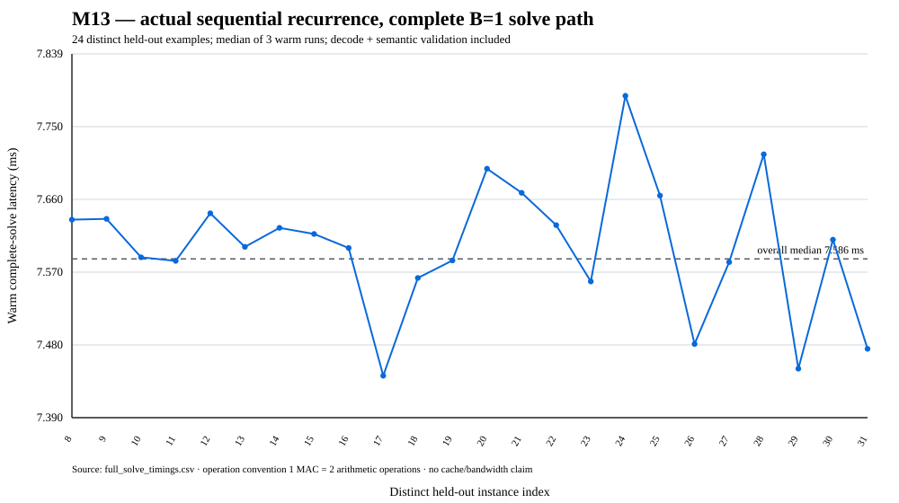

<div align="center">

# SPECTRA

### Sparse Policy-guided Energy-aware Cache-Ternary Recursive Agent

**A research instrument for compact recursive models, checked search, and native inference.** Floating-point capability results and ternary deployment results have separate evidence boundaries.

[Architecture spec](docs/ARCHITECTURE.md) · [Measurement protocol](docs/M13_PROTOCOL.md) · [Reasoning stack](#7-the-reasoning-stack) · [Telemetry](#8-the-telemetry-firehose)

</div>

---

## CPU development update: verified symmetry restarts

An optional frozen-model policy runs eight identity cycles and then three exact
transformed views with four cycles each. On consumed development it solves
**255/256 Sudoku** and **53/256 maze** model-example cases, versus **241/256**
and **37/256** for 32-cycle identity continuation, with lower local mean and p95
complete-solve latency and zero observed lost solves against that control.

These are adaptively selected results on **128 distinct puzzles × two model seeds
per task**, not fresh confirmation or a win over the perfect, faster classical
comparators. The equal-20-cycle maze control is faster but solves fewer cases.
No GPU or training update is used. Full timing scopes, original and replayed
raw evidence, a preserved first-run retention failure, exact source inventories,
and all claim boundaries are in [CPU progress](docs/CPU_PROGRESS.md).

The frozen numerical replay has a separate, restricted
[explicit-order reproduction profile](docs/ORDERED_REPLAY.md); it is not the
B=1 symmetry policy or a universal CPU-portability guarantee.

The [September 11 review](docs/RESEARCH_REVIEW_20260911.md) gives the evidence-based
assessment and research priorities. The new paired audit retains an important
qualification: the Sudoku p95 latency-ratio interval crosses 1 despite its lower
point estimate. The maze equal-20-cycle comparator is faster. Neither result is
an independently confirmed general search advantage.

## Current evidence: M16 integration and M17 outcome

**Current validated evidence comes from CPU experiments; general-purpose reasoning and physical-energy advantages remain unestablished.**

The latest implemented paths add ancestor-wide data exclusions, typed evaluator targets,
verified-answer retention, immutable native weight handles, and native Sudoku/maze
checking. Historical model and scalar deployment interfaces remain available and
unchanged by default. See [current research state](docs/RESEARCH_STATE.md) and
[consolidation review](docs/INTEGRATION_REVIEW.md).

M16's retained complete-solve comparison improved the **native-checker execution
path**: the paired mean latency ratio was **0.669** (95% crossed-bootstrap interval
**0.663–0.675**) against the reference path, with identical outcomes on **512
model–example cases**. This is an implementation comparison, not evidence that
learned search beats an optimized external solver. The exact symbolic comparator
remains faster and perfect on these small puzzles. Raw sources, checkpoints and
results are retained under [`results/m16/`](results/m16/).

**M17 completed but failed its two-family scientific gate.** On the harder Sudoku
fixed pools, quality-target selection improved over improvement-target selection
by **0.58594** on confirmation (95% interval **0.52734–0.64453**, 512 model–example
pools). Maze failed the development gate, so its confirmation was **not opened**.
These are fixed-pool selection effects, not automatically closed-loop speedups.
The negative result and trained checkpoints remain in [`results/m17/`](results/m17/).

The integration audit checks retained source bytes, ancestral exclusions and
manifest/array fingerprints, independently validates stored complete-solve answers,
and reproduces fixed-pool/closed-loop summaries. It does not train models or reopen
confirmation. A valid negative experiment passes the integrity audit while its
scientific status stays negative:

```bash
python -m pip install --index-url https://download.pytorch.org/whl/cpu torch==2.10.0
python -m pip install -r requirements-cpu-research.txt
OMP_NUM_THREADS=1 MKL_NUM_THREADS=1 OPENBLAS_NUM_THREADS=1 MAX_JOBS=1 \
  python -m pytest -m "not slow" -ra
python scripts/verify_retained_results.py --out outputs/retained-audit.json
python scripts/verify_fixed_pool_replay.py --cpu-profile historical-ordered --out outputs/fixed-pool-replay
python scripts/verify_cpu_progress.py --out outputs/restart-integrity.json
python scripts/verify_symmetry_checkpoint_replay.py --out outputs/restart-replay
python scripts/audit_research_frontier.py --out outputs/frontier.json --verify-report results/reliability/research_frontier_audit.json
```

The [fixed-pool inference replay](docs/FIXED_POOL_REPLAY.md) additionally
reconstructs all 16,384 published M17 candidate states and 49,152 evaluator scores
from the frozen checkpoints, with independently constructed labels and exact
pool-tensor hashes. Its explicit ordered-arithmetic reproduction profile matters: host-default
CPU dispatch is not assumed bitwise identical. Maze confirmation remains unopened.
The maze diagnostic also shows that every nonempty invalid restored path receives
the same structural score, 0.75; the failed two-family gate is not promoted.

The audit refuses an existing output file. Both Python 3.11 and 3.13 run the CPU
regression and evidence checks in CI. Long training tests are separately marked
`slow`; passing the fast suite is not represented as passing those training gates.
Physical energy remains unavailable where no valid counter is exposed.

---

## Abstract

SPECTRA is a **scientific instrument** for testing whether compact recursive reasoning plus learned test-time control can improve the quality/compute frontier on constrained CPUs. The reasoning core uses ternary weights in `{-1, 0, +1}` with quantized recurrent state boundaries, explicit recursive execution, latent search, learned routing/halting, and independent symbolic task validation.

M13 tightened the measurement boundary substantially. Hardware timings and counter readings are retained as raw rows; derived arithmetic-intensity values are labeled as logical traffic models rather than measured DRAM traffic; CPU-package RAPL is never called GPU or whole-system energy; and unavailable counters remain unavailable rather than becoming zero. The accepted M13 raw evidence and regenerated figure live in [`results/m13/`](results/m13/).

**M13 retained measurement host:** Intel Xeon Platinum 8573C, Linux `6.17.0-1022-azure`, process affinity CPUs `0–3`, PyTorch threads `2`, observed `performance` governor. These measurements characterize that run only.

| Quantity | Retained result | Scope |
|---|---:|---|
| Native correctness | scalar/native fidelity contracts pass | correctness evidence |
| Complete sequential B=1 solve | **7.586 ms median / 7.819 ms p95** | 24 distinct held-out instances × 3 warm rounds; decode + semantic validation included |
| Cold first solve | **16.417 s** | includes artifact load and native extension build/load |
| Precomputed K-input reuse | **0.36 → 31.13 GOP/s** (`K=1→256`, AVX2) | microbenchmark with all `K` inputs already materialized; **not** sequential recurrence evidence |
| Modelled K-input intensity | **7.64 → 407.06 operations/byte** | external first-touch logical-byte model; **not measured DRAM bytes** |
| Packed weights in M13 runtime | **3,112 B** | packed ternary weight tensors only |
| Full model state | **53,184 B** | parameters + persistent buffers under actual dtypes |
| Search-tree tensor storage | **73,472 B** | controlled reference tree tensor storages; excludes Python allocator overhead |
| Process RSS | **374.72 MiB sampled peak** | 0.5 ms sampler; short allocations can be missed |
| CPU-package energy | **unavailable** | hosted runner exposed no readable package domain; joules are `null`, not `0` |

---

## 1. Operation and traffic convention

M13 uses one arithmetic convention everywhere:

$$
1\ \mathrm{MAC} = 2\ \mathrm{arithmetic\ operations}.
$$

Throughput is therefore reported in arithmetic GOP/s, and arithmetic intensity is reported in arithmetic operations per declared byte. For a dense matrix-vector product with `O·H` MACs, the arithmetic numerator is `2OH`, not `OH`.

The important denominator distinction is equally explicit. `eval/roofline.py` now models **logical/external first-touch bytes**: packed weights, activation inputs, outputs, and requantization metadata. Those are not hardware DRAM transactions. For example, the retained 512×512, K=1 precomputed-input row has:

```text
MACs                              262,144
arithmetic operations             524,288
packed weights                     65,536 B
input activations                     512 B
output activations                    512 B
requant metadata                    2,048 B
modelled external first-touch      68,608 B
arithmetic intensity                  7.642 operations/B
```

A roofline classification produced from assumed peak compute and assumed bandwidth is a **model**, not evidence that a measured workload resided in a particular cache or saturated DRAM.

---

## 2. Precomputed K-input reuse is a microbenchmark

`spectra_weight_stationary_gemv` accepts a pre-created `[K,H]` activation matrix in one native call. It decodes each packed weight row and applies that row to all `K` already-materialized input vectors. This is useful for measuring reuse **inside that kernel invocation**.

It is not the same workload as actual recurrent reasoning, where step `k+1` cannot exist until step `k` has produced the next recurrent state. M13 therefore labels every retained row:

```text
workload = precomputed_input_reuse
```

and benchmarks actual sequential recurrence separately.

On the accepted Xeon runner the AVX2 precomputed-input microbenchmark rose from `0.358 GOP/s` at `K=1` to `31.134 GOP/s` at `K=256`. The corresponding derived intensity rose from `7.64` to `407.06 operations/B` because the model amortizes packed weights while also accounting for the growing K input/output activation traffic.

These measurements do **not** establish cache residency or a bandwidth bottleneck. The raw rows are in [`results/m13/precomputed_input_reuse.csv`](results/m13/precomputed_input_reuse.csv).

---

## 3. The fused AVX2 microkernel

The historical integer kernel packs ternary codes and uses vector sign/select operations for the hot dot-product path, with integer requantization. Its scalar and AVX2 implementations have correctness contracts and bit-exact comparison tests.

The K-input benchmark remains useful as a native-kernel microbenchmark, but M13 intentionally separates it from the deployed M10/M11 mixed-precision recursive runtime. The M10 deployed runtime uses its correctness-first packed-ternary FP32 scalar C++ primitive plus explicit FP32 attention, normalization, GELU, residual, A8 boundary, halt, and decode work. A fast isolated AVX2 microkernel is not by itself a whole-solve performance claim.

---

## 4. Memory-size sweeps are not cache-residency proofs

Earlier SPECTRA experiments observed relatively flat throughput across a broad weight-matrix-size sweep. That observation remains useful raw microbenchmark behavior, but the interpretation is narrower after M13:

> A flat throughput curve alone does not prove that weights reside in L2/L3, does not prove that accesses came from DRAM, and does not prove that the kernel is bandwidth-bound or decode-bound.

Establishing those claims requires independent hardware evidence such as cache-miss / memory-controller / PMU counters under a controlled frequency and affinity protocol. M13 does not have that evidence, so the accepted state records:

```text
cache_residency_established     false
bandwidth_bottleneck_established false
```

The project name and cache-aware design motivation remain; measured cache residency is an open hardware-validation question.

---

## 5. Adaptive token execution

SPECTRA has both heuristic and learned active-token control. M11 established that real adaptive execution can skip declared active-query/pointwise work while keeping dense K/V context, but also showed that control/gather/scatter overhead can erase a theoretical arithmetic saving on small workloads.

M12 then added a real grounded actor-critic training path for the router and halter. Its bounded held-out policy result was **negative**: the learned router collapsed toward low activity, reduced the logical cost proxy, did not halt earlier, solved `0/96` like the baselines, and slightly reduced structural score. The training path passed; learned-control superiority did not.

Accordingly, microkernel active-row savings are not reported as automatic end-to-end speedups or quality improvements.

---

## 6. W1.58A8 numerics and footprint

Weights are ternarized per output channel by absmean scaling with a straight-through estimator during training. Ternary codes pack four 2-bit codes per byte. Recurrent A8 boundaries use per-token dynamic quantize/dequantize semantics in the accepted M10 deployment path.

A small packed representation can be a necessary condition for cache-aware execution, but **size alone is not proof of cache residency**. M13 therefore reports separate memory scopes rather than collapsing them into one “model RAM” number:

- packed ternary weights;
- complete in-memory model parameter/buffer state;
- explicit search-tree tensor storage;
- current process RSS;
- sampled window-local RSS peak;
- Linux lifetime `VmHWM` when available.

For the retained M13 pilot those values were `3,112 B`, `53,184 B`, `73,472 B`, `374.72 MiB`, `374.72 MiB`, and `375.43 MiB`, respectively. The process figures include Python/PyTorch/native-runtime overhead and are intentionally not presented as model-weight memory.

---

## 7. The reasoning stack

**Grounded router/halter actor-critic.** M12 uses per-example terminal/truncation masks and GAE-λ. True terminals zero the value bootstrap; time-limit truncations retain the final value bootstrap but end the sampled trace. Forced environment actions receive no invented policy-gradient credit. The dense shaping term uses the discount-consistent potential form:

$$
F(s_k,s_{k+1}) = \gamma\,\Phi(s_{k+1}^{\mathrm{effective}}) - \Phi(s_k),
$$

with terminal effective potential zero and truncation retaining the actual next-state potential. Step/token compute costs and task-success / voluntary-halt terms are logged separately.

**Latent MCTS.** SPECTRA has an inspectable MCTS reference with explicit node state, PUCT selection, work counters, and verifier interfaces. M09’s trained action mechanism did not meet its preregistered practical-effect threshold, so the repository does **not** claim learned-search benefit from that milestone.

**Grounded verifier.** The independent verifier path is trained against frozen-reasoner continuation behavior and is checkpoint-compatible with the reasoner. Symbolic task correctness remains the terminal semantic authority for accepted Sudoku evaluation; verifier scores are not substituted for exact task correctness.

The effective recursive depth of the core remains controlled by the explicit TRM schedule and its execution-state API.

---

## 8. The telemetry firehose

`common/telemetry_logger.py` extracts run telemetry independently of plotting. M13 unified its physical-energy reader with `eval/edge_energy.py` through `common/energy_counters.py`.

| Stream | Output | Captured |
|---|---|---|
| MCTS tree | `mcts_graphs.jsonl` | visits, Q, verifier diagnostics, principal variation |
| Hardware | `hardware_telemetry.csv` | validated CPU-package energy **or explicit unavailable reason**, latency, sampled RSS maximum, sampling interval/limit |
| Latents | `latent_states.parquet` | INT8 latent state plus active-token mask |
| Microsecond trace | `trace.json` | Python/native/search spans |
| Scaling | `spectra_scaling_laws.csv` | task × params × rollouts × correctness with nullable physical-energy fields |

Physical-energy semantics are deliberately strict:

- each readable counter has explicit identity, parent domain, class, and `max_energy_range_uj`;
- one conservative wrap can be reconstructed from the counter-specific range;
- reset-like decreases, malformed endpoints, changed counter sets, and partial reads invalidate the window;
- nested child domains are never added to a package total;
- CPU-package RAPL can include cores and other on-package components, but it is **not discrete-GPU energy and not whole-system/wall energy**;
- unavailable energy is `None` / JSON `null`, never fabricated `0.0`.

Controlled counter fixtures cover normal zero, wraparound, reset/corruption, out-of-range, unreadable/partial data, and nested domains. Those fixtures are synthetic contract tests, not physical energy measurements.

---

## 9. M13 complete-solve measurement

The primary M13 workload is actual sequential `CPURecursiveRuntime.forward` execution. Each timed B=1 solve includes the recurrent native/mixed-precision runtime, output decode, and semantic Sudoku validation. Training/export are excluded from warm latency; cold start is recorded separately.

Accepted raw timing protocol:

```text
held-out instances           24 distinct
warm-up instances             4 distinct
timing rounds                 3
raw warm timing rows          72
inference_mode              true
reference targets used      false
warm median               7.585985 ms
warm p95                  7.819384 ms
cold first solve        16417.175752 ms
```

The cold observation includes artifact load/validation, runtime construction, native extension build/load, and the first complete solve. It is never averaged into the warm latency.

For one complete recurrent solve, the retained native linear work counter reports `1,583,104 MACs = 3,166,208 arithmetic operations`. M13’s traffic model accounts for packed/scales/FP persistent storage, FP32 native input/output tensor boundaries, recurrent y/z read/write lower bounds, input/decode traffic, and separately discloses algorithmic attention-score bytes if materialized. The denominator is labeled **logical tensor/interface bytes**, not measured cache or DRAM traffic.



---

## Build and test

```bash
pip install -r requirements.txt
pytest -m "not slow"
python setup.py build_ext --inplace       # optional native AVX2 kernel
pytest tests/test_kernel.py
```

The full design specification lives in [`docs/ARCHITECTURE.md`](docs/ARCHITECTURE.md). Measurement acceptance is defined in [`docs/M13_PROTOCOL.md`](docs/M13_PROTOCOL.md), with durable raw evidence in [`results/m13/`](results/m13/).

## The open question

SPECTRA now has stronger training, deployment, adaptive-execution, and measurement plumbing than its early prototype, but the central quality/energy result remains open:

> Under a fixed, **properly measured** physical energy budget, can a compact recursive reasoner plus learned latent control/search outperform an appropriate larger baseline?

Answering that requires a host with valid physical package counters (or an explicitly defined external power meter), representative trained models that actually solve the task, and a preregistered comparison. M13’s hosted runner exposed no readable package RAPL domain, so the accepted result is **energy unavailable**, not zero and not an inferred joule number.

## Citation

```bibtex
@misc{spectra2026,
  title  = {SPECTRA: Recursive Latent Reasoning under Explicit Edge Compute and Measurement Contracts},
  note   = {Open scientific instrument; capability and iso-energy results remain bounded by accepted milestone evidence},
  year   = {2026}
}
```

## License

Released under the [MIT License](LICENSE). © 2026 The SPECTRA Authors.
