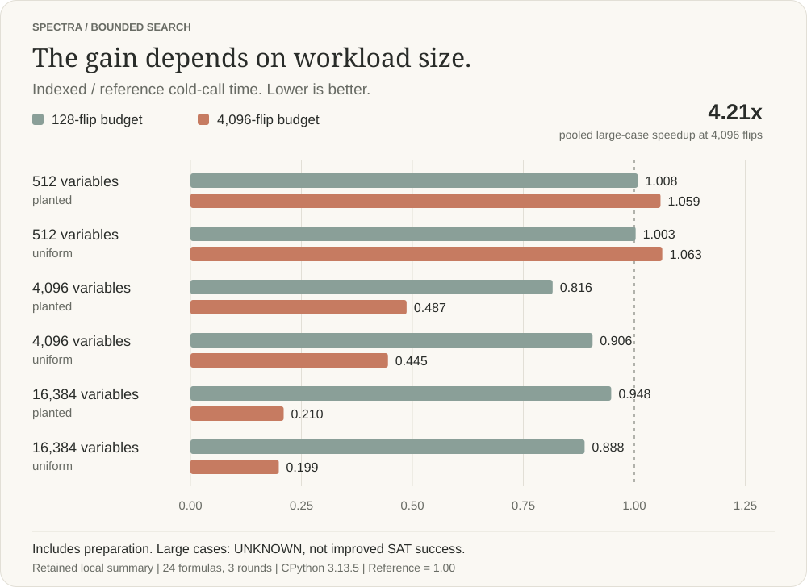

# SPECTRA

### Checked search. Faithful CPU execution.

SPECTRA is a CPU-first research toolkit for **bounded Boolean search, same-model
SVM inference, and reproducible reasoning experiments**. The public Python API
and command line require no third-party packages. Native execution is an explicit,
optional build; neural training and historical experiments live in a separate layer.

[Quick start](#quick-start) · [Measured results](#measured-results) ·
[Native deployment](#native-deployment) · [Development](docs/DEVELOPMENT.md) ·
[Documentation](docs/README.md)

**Python 3.10+ · MIT-licensed code · CPU-first · Explicit verification boundaries**

## What is in the project?

| Track | What it does | What it does not establish |
|---|---|---|
| **CNF search** | Bounded classical search, reusable indexes and independent checks against original clauses | A complete SAT solver, an UNSAT proof, or improved learned reasoning |
| **CPU SVM execution** | Explicit native builds, reusable model state, raw-input pipelines and decision-receipt replay | Perfect ground-truth labels, universal speedups, or cross-platform bitwise equality |
| **Research and evidence** | Retained models, protocols, negative results, replay tools and byte-integrity manifests | Scientific validity or authenticity merely because a hash matches |

The latest published release is [v0.7.1](https://github.com/tugrapaydiner/SPECTRA/releases/tag/v0.7.1).
**This checkout also includes unreleased work**, notably native SVM deployment and
prepared/compiler experiments. A source installation is not identical to the
published v0.7.1 wheel. [Delivery status](docs/STATUS.md#delivery-state) separates
released artifacts, merged source and unmerged research. No release is published
by this review.

## Quick start

From a checkout, create a virtual environment and install the base package:

```bash
git clone https://github.com/tugrapaydiner/SPECTRA.git
cd SPECTRA
python -m venv .venv
```

Activate it with `source .venv/bin/activate` on Linux/macOS, or
`.venv\Scripts\Activate.ps1` in Windows PowerShell. Then:

```bash
python -m pip install .
python -m spectra doctor
python -m spectra cnf solve examples/tiny.cnf --seed 7 --max-flips 1024 --out answer.json
python -m spectra cnf check examples/tiny.cnf answer.json
```

`spectra` and `python -m spectra` are equivalent. The base installation needs
neither PyTorch nor a compiler. Output paths must be new: existing files are not
replaced. A completed search reports **`SAT_VERIFIED` or `UNKNOWN`**; exit code 0
alone is not a solved problem. `UNKNOWN` means the budget ended without a verified
solution, not that the formula is unsatisfiable.

```python
from spectra.cnf import CNF, PreparedCNF, solve

problem = CNF(2, ((1, 2), (-1, 2)))
reference = solve(problem, seed=7, max_flips=128)
prepared = PreparedCNF(problem)  # build a reusable index once
indexed = prepared.solve(seed=7, max_flips=128)

assert reference.path_sha256 == indexed.path_sha256
if indexed.status == "SAT_VERIFIED":
    assert problem.satisfied(indexed.witness)
```

For an indexed cold call from the CLI:

```bash
python -m spectra cnf solve examples/tiny.cnf --backend indexed --seed 7 --max-flips 4096 --out indexed.json
```

The historical `compact` backend remains the default. See [API and CLI](docs/API.md)
for strict Boolean witnesses, input limits, formats and exit codes.

## Measured results

These figures visualize **preserved published summaries, not new measurements
from this review**. Each experiment keeps its own models, host, timing boundary
and limitations. The numerical inputs, immutable source hashes and regeneration
command are in [chart provenance](assets/readme/README.md).

### Identical bounded search, less work spent on bookkeeping



On the frozen local primary comparison, the indexed backend takes **238.881 ms
versus 1,005.795 ms** for the reference: a cold-call ratio of **0.237505**
(95% formula-bootstrap interval **0.216128–0.281891**). The comparison checks
1,152 measured calls and 384 distinct backend paths over 24 formulas.

The large timed cases return **`UNKNOWN`**. This is cheaper execution of the same
bounded search, **not more SAT successes**. Small cases regress, and cold Python
allocation increases. Preparation is included; parsing and serialization are not.
[Protocol, all cells and memory tradeoffs →](docs/EFFICIENCY_GUIDE.md)

### Compare against native alternatives, not only Python overhead


The matched-AVX2 comparison preserves each fitted SVM's labels while testing
native LIBSVM, generated C and fixed SPECTRA profiles. **Generated C is faster
than default SPECTRA on five of the six smaller models.** HAR's generated-C export
timed out, so that comparison remains missing—not a SPECTRA win.

On HAR, default SPECTRA takes **74.412 μs/row versus 615.398 μs/row** for native
LIBSVM. But the separately fitted native linear model takes **3.079 μs/row** and
has higher observed accuracy: **2,849/2,947 versus 2,835/2,947** correct. Its
subject-bootstrap accuracy interval includes zero; this is not established
statistical superiority. **The task-usefulness gate remains failed.** Faster
execution of an SVM is not proof that the SVM is the right model for the task.
[Full controls, accuracy, missing comparison and timing boundaries →](experiments/native_baselines/RESULTS.md)

The historical neural/compiler experiments remain separate. Reduced returned
tensor storage is not reduced peak RAM; preserving a model's outputs is not
improving its accuracy. Start with [the research review](docs/RESEARCH_REVIEW_20260911.md),
[prepared FP execution](docs/TRAINED_FP_GUIDE.md) and
[compiler controls](docs/COMPILER_BASELINE_GUIDE.md).

## Native deployment

For supported fitted pipelines, export the model and preprocessing plan, then
compile explicitly on the execution machine. This example builds libraries;
it does not train or download a classifier:

```python
from spectra.svm import build_runtime
from spectra.svm_preprocess_native import build_preprocessor

library = build_runtime("native-build")
preprocessor = build_preprocessor("preprocessor-build")
print(library)
print(preprocessor)
```

Use the printed paths and a real exported bundle with the offline JSONL runner:

```bash
spectra svm run exported-model --library /path/to/runtime-library \
  --preprocessor /path/to/preprocessing-extension \
  --input rows.jsonl --output predictions.jsonl
```

Each input line is a feature array in the fitted plan's column order. The runner
uses bounded chunks and publishes a complete new output file only after clean
EOF and successful inference. A late invalid row does not publish a partial final
result. Completion records bind the input/output bytes and model identity; they
are not independent proofs of true labels.

[Export a pipeline](docs/SVM_PIPELINE.md) ·
[Build/platform boundaries](docs/SVM_PORTABILITY.md) ·
[Streaming and failure handling](docs/SVM_STREAM.md) ·
[Independent decision receipts](docs/SVM_RECEIPTS.md)

## Verify and develop

```bash
python -m pip install ".[test]"
python -m pytest tests/public --confcutdir=tests/public
python scripts/check_release_readiness.py
python scripts/render_readme_charts.py --check
```

For the pinned CPU research environment, full regressions, retained-checkpoint
replay, explicit native builds and **sdist-to-wheel testing outside the checkout**,
follow [Development](docs/DEVELOPMENT.md). Historical slow retraining tests are
separate and can require substantially more memory. Test passes are not evidence
of generalization or a guarantee that every platform/input works.

Read [Security](SECURITY.md) before accepting external inputs, native libraries or
checkpoints. Read [Contributing](CONTRIBUTING.md) before changing numerical code,
benchmarks or retained evidence. Release operators should use
[Releasing](docs/RELEASING.md), not old experiment logs.

```text
spectra/        public APIs, CLI and optional native runtime sources
examples/       runnable CNF inputs
model/ train/   historical neural implementation
common/ data/ eval/ deploy/  evidence-bound compatibility modules
scripts/       reproducible checks, experiments and maintenance commands
tests/         regression contracts; public/ requires only pytest
experiments/   separately scoped native and research comparisons
results/       retained evidence, including negative outcomes
assets/readme/ source-bound charts and their machine-readable inputs
docs/          current guides, protocols and history index
maintenance/   historical byte-retention receipts
```

Unmerged research is available through the repository's pull requests; it is not
silently incorporated into these installation instructions. The
[history index](docs/history/README.md) preserves older work. Code is distributed
under [MIT](LICENSE); upstream datasets and third-party components retain their
own attribution and license terms.
