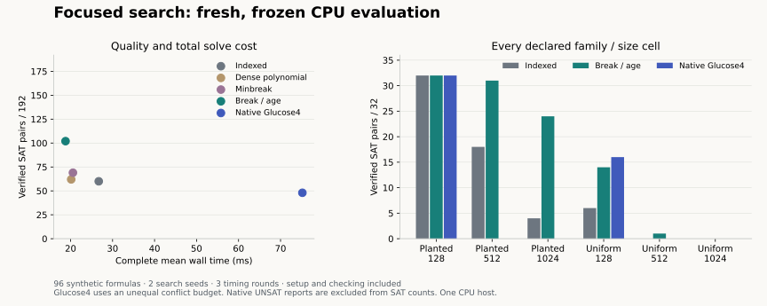

# Focused search: fresh evaluation and engineering decision

**The recovered break/age candidate passes the predeclared optional-backend gate
on this synthetic panel.** It verifies **102/192 formula/seed cases versus 60/192**
for indexed search, with **29.6% lower mean complete wall time**.
The original recovered solver was evaluated unchanged; this pass establishes new
retained evidence, not a new algorithm or neural training result. The historical
compact default remains unchanged.



## Identity and reproduction

Candidate, generator, runner, analysis and protocol were published before first
evaluation generation at commit
`fceff2360fc7a2d9c7c2c6a44e0a750d878eae17`, tree
`215b5148d52be0832eaf99b2a8ea8cdc1c3a2591`. [FROZEN.json](FROZEN.json) binds all
17 declared source files. [EVIDENCE.json](EVIDENCE.json) binds the retained archive;
[SUMMARY.json](SUMMARY.json) contains every cell, paired comparison and interval.
The [protocol](PROTOCOL.md) predates the observations. [PR #52](https://github.com/tugrapaydiner/SPECTRA/pull/52)
is stacked on the recovered candidate in #51; this work is unreleased.

From the research branch's full checkout, recompute the report with only Python's
standard library, then replay all 768 local-search formula/seed/arm trajectories:

```bash
python -I -S experiments/focused_evaluation/analyse.py experiments/focused_evaluation/evidence-20261005.zip
python -I -S experiments/focused_evaluation/replay.py experiments/focused_evaluation/evidence-20261005.zip
```

The verifier checks all **96 formulas, 2,880 timing observations and 36 memory
observations**, complete source/artifact bindings, the declared generator's inputs,
Boolean witnesses against original clauses, local residuals and budgets, and
repeat-round determinism. These commands verify/replay retained inputs; they do
not recreate historical timings or independently certify native UNSAT reports.

For a new measurement of the same consumed panel, create an isolated checkout of
the freeze commit, copy this FROZEN.json there, install `python-sat==1.9.dev15` in
a virtual environment and run `run.py run --freeze FROZEN.json --out NEW_DIRECTORY`.
The runner refuses an existing directory and a different frozen HEAD/source.
Such a rerun is reproduction, never new independent confirmation. The figure is
regenerated from SUMMARY.json by `python experiments/focused_evaluation/plot.py`
with matplotlib; the solver and archive verification do not require matplotlib.

## All arms and costs

96 formulas comprise six family/size cells, each with 16 formulas and two search
seeds. Timing rounds are repeated measurements, not additional quality trials.
The CPU is pinned to one available core. Whole-call wall and process-CPU times
include input conversion, preparation, search, result construction, solver
teardown and independent checking. Imports, disk access and serialization are
outside this boundary. UNKNOWN calls remain in the averages.

| Arm | Verified SAT | UNKNOWN | UNSAT reported | Mean wall ms | p95 wall ms | Mean CPU ms |
|---|---:|---:|---:|---:|---:|---:|
| indexed | 60/192 | 132 | 0 | 26.705 | 43.146 | 26.698 |
| poly | 62/192 | 130 | 0 | 20.148 | 34.079 | 20.141 |
| minbreak | 69/192 | 123 | 0 | 20.560 | 34.924 | 20.550 |
| novelty_break | 102/192 | 90 | 0 | 18.798 | 34.118 | 18.789 |
| glucose4 | 48/192 | 128 | 16 | 75.201 | 284.821 | 75.152 |

All Python arms receive 2,048 total flips. Glucose4 requests 2,000 conflicts,
which are unequal work units and not a hard deadline. It exceeds that request in
**414/576 timed native calls**, reaching **59,398 conflicts**. Its two seed slots
are deterministic repetitions; 16 UNSAT reports represent eight formulas and
are not proof-checked. The native result is not a claim of equal-budget superiority.
Glucose4 is faster on the small planted cell and verifies more SAT cases on the
small uniform cell; it also returns useful UNSAT reports that local search cannot.

| Family:variables | Indexed | Dense poly | Minbreak | Break/age | Native Glucose4 |
|---|---:|---:|---:|---:|---:|
| planted3:128 | 32/32 | 32/32 | 32/32 | 32/32 | 32/32 |
| planted3:512 | 18/32 | 21/32 | 24/32 | 31/32 | 0/32 |
| planted3:1024 | 4/32 | 0/32 | 2/32 | 24/32 | 0/32 |
| uniform3:128 | 6/32 | 9/32 | 11/32 | 14/32 | 16/32 |
| uniform3:512 | 0/32 | 0/32 | 0/32 | 1/32 | 0/32 |
| uniform3:1024 | 0/32 | 0/32 | 0/32 | 0/32 | 0/32 |

The candidate adds 46 verified pairs and loses four relative to indexed search,
for **42 net additional successes (+21.875 percentage points)**. It solves at
least one seed on 56/96 formulas versus indexed's 37/96. No pooled cell loses
successes, although individual cases do. Large uniform 3-SAT remains a major
failure mode: only 1/32 pairs at 512 variables and 0/32 at 1,024.

The dense polynomial control is cheaper but adds only two net verified pairs;
minbreak adds nine. The selected policy bundle supplies most of the quality gain.
This supports the bundle, not an isolated causal claim about age alone: pool
ordering, tie breaking and noise also affect trajectories. Most added successes
are on planted formulas. Do not generalize this distribution to industrial SAT.

## Uncertainty, admission and memory

A paired, family/size-stratified bootstrap uses formulas as clusters, keeping
both seeds and all rounds together. With the 2,000 predeclared resamples, the
descriptive 95% interval for the SAT-rate difference is **+16.7 to +27.6 percentage
points**; the mean wall-time ratio is **0.704** with interval
**0.682–0.727**. These intervals describe this sampled synthetic panel; repeated
measurements do not establish cross-host or real-task generalization.

All four declared point conditions pass: at least five extra verified SAT pairs,
no larger pooled mean wall time, no cell losing more than two pairs, and no invalid
SAT witness. This supports retaining the optional candidate and studying transfer;
it does not authorize replacing the default or claiming frontier reasoning gains.

Memory uses the first two predeclared formulas per cell (12 total), seed 17,
measured separately from timing. A fresh small relay spawns each fresh RSS worker
so the timing supervisor's peak is not inherited as the worker's floor. Every
worker imports the same Python/native modules. Python allocations use separate
tracemalloc workers and exclude native allocations.

| Arm | Mean peak RSS MiB | Maximum peak RSS MiB | Mean traced peak MiB |
|---|---:|---:|---:|
| indexed | 21.349 | 22.980 | 1.0346 |
| novelty_break | 21.382 | 23.105 | 1.0351 |
| glucose4 | 21.661 | 22.891 | not measured |

The measured mean RSS difference is about 0.033 MiB, within a roughly 21 MiB
interpreter/import baseline. This small descriptive subset supports no meaningful
memory-saving claim. RSS, traced allocations and model storage are different units.

## Limits and retained failures

This is one CPU host, one fixed density and two synthetic distributions. It has
no neural learning, external task transfer, latency SLA or energy result. Timing
excludes process startup and file I/O. Uniform satisfiability is not assumed.
Four indexed successes are lost and large uniform cases remain mostly unresolved.
No tuning followed evaluation. Original raw rows are preserved without retiming.

The older focused development rows remain missing and their summaries remain
unverified. This fresh study does not repair them. An initial environment-reuse
command failed because the old temporary virtual environment no longer existed;
a new environment was created before any experiment. No evaluation row failed or
was replaced. Historical models, original results, tolerances and sealed inputs
are unchanged. Source and installed-wheel acceptance are recorded in the
[maintenance checkpoint](../../maintenance/reviews/research-engineering-20261005.md).
