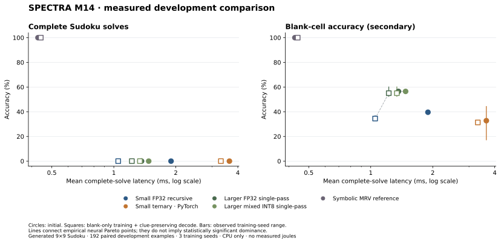

# M14 retained negative comparison

**Scientific status: INCOMPLETE_TARGET_MISSED.** See [acceptance record](../../docs/M14_ACCEPTANCE_GATE.md) and [measured table](RESULTS.md).

`development_reproduction.zip` contains raw predictions and timings, development data, fit metadata and frozen selections needed to independently regenerate the tables and figure. It contains no checkpoint weights. The separate full evidence bundle contains all datasets, all 54 checkpoints, tuning rows, logs and hashes.

Reproduction code pin: `896cce26334dc7f1d5505cff32a20ab072a843eb`. Local/GitHub commit metadata differ; identical source trees are recorded in `source_commit_mapping.json`.

From the repository root:

```bash
python -m zipfile -e results/m14/development_reproduction.zip outputs/m14_saved
python scripts/render_m14_comparison.py --out outputs/m14_saved/latency_v1
```



Full evidence ZIP SHA-256: `2599f22c763b20e7f10883c998a8f98359c7cef7ac47f75c7fd02bb291188f39`.
